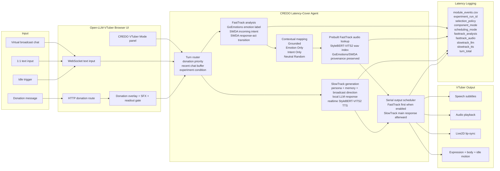
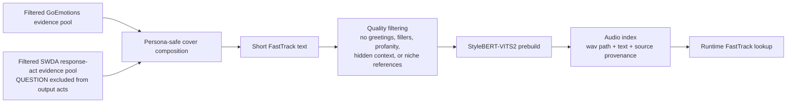

# Current CREDO Runtime Pipeline Mermaid

작성 기준: 2026-05-29 KST

이 그림은 논문 초고의 현재 1차 실험 기준만 표현한다. 보류/비활성 항목인
Unity, TCP stream, ASR/STT, YouTube live mode, spaCy spoken echo,
Parallel/prefetch scheduling, standalone nonverbal interjection audio는 포함하지
않는다.

## Paper Figure Version

## Offline FastTrack Audio Build

